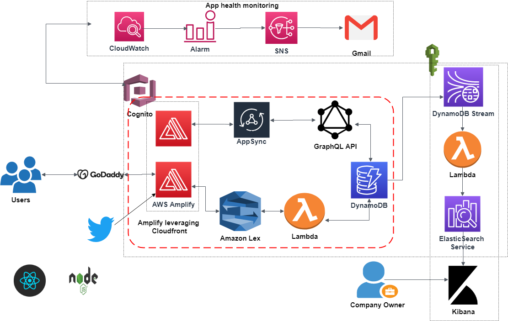

# Carbon Footprint Tracker

A cloud-native serverless application that helps users track and reduce their carbon footprint from food consumption.

## Introduction

Climate change is a major concern today, and food production plays a significant role in greenhouse gas emissions. As technology and industrialization advance, our food habits have shifted toward processed and packaged items, increasing carbon emissions. 

Every organic product containing hydrocarbons has a **carbon footprint**—the total amount of CO2 and other greenhouse gases emitted throughout its life cycle. This project helps users make informed food choices by calculating their carbon emissions and suggesting sustainable alternatives.

## Project Overview

This project features a chatbot that calculates the carbon emissions of various food products. Users input the type of item and quantity, and the bot evaluates the total carbon footprint in **kg CO2 equivalent**. Users can also set an emission budget and track whether they exceed their limit.

### **Technology Stack**
- **Frontend:** React (bootstrapped with Create React App)
- **Backend:** Node.js
- **Cloud Provider:** AWS

### **AWS Services Used**
- **Cognito** – User authentication and authorization
- **AWS Lambda** – Serverless function execution
- **AWS Amplify** – CI/CD deployment and hosting
- **Amazon Lex** – AI-powered chatbot
- **DynamoDB** – NoSQL database for storing user data
- **AWS AppSync** – GraphQL API backend
- **Elasticsearch Service** – Data indexing and analytics
- **Kibana** – Data visualization and reports
- **CloudWatch** – Application health monitoring
- **SNS** – Alerts and notifications

### **Additional Services**
- **GoDaddy** – Domain name registration
- **Twitter API** – Embedded timeline integration

## Architecture Diagram



## Features

- Cloud-native, serverless application
- CI/CD enabled with GitHub
- Low latency with AWS Amplify and CloudFront
- API-driven backend using GraphQL
- AI-powered chatbot using Amazon Lex
- Real-time data analytics with Elasticsearch
- Data visualization with Kibana
- Automated monitoring with CloudWatch and SNS
- Twitter integration for updates and discussions

## How It Helps Users

- **Track Carbon Emissions** – Find out how much CO2 is emitted from food choices
- **Set and Monitor Goals** – Define a carbon budget and track progress
- **Discover Sustainable Alternatives** – Get recommendations for lower-emission options
- **Visualize Impact Over Time** – Use graphs and reports to analyze emissions
- **Encourage Sustainable Habits** – Share lifestyle changes with others

## How It Helps Organizations

- **Encourage Sustainable Consumption** – Help users choose lower-emission products
- **Provide Data for Research** – Assist policymakers with insights for targeted policies
- **Promote Eco-Friendly Products** – Support sustainable producers by recommending their products

## Getting Started

### **Prerequisites**
- **Node.js** (Latest LTS version)
- **AWS Account** (for using AWS services)
- **GitHub Account** (for CI/CD setup)

### **Installation**
1. Clone the repository:
   ```bash
   git clone https://github.com/your-username/carbon-footprint-tracker.git
   cd carbon-footprint-tracker
